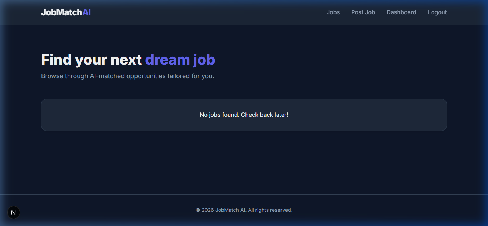

# 🚀 JobMatch AI - Scalable AI Job Matching Platform

<p align="center">
  
</p>

<p align="center">
  <a href="https://github.com/ayushtripathi-45/job-matching-platform/stargazers"></a>
  <a href="https://github.com/ayushtripathi-45/job-matching-platform/network/members"></a>
  <a href="https://github.com/ayushtripathi-45/job-matching-platform/issues"></a>
  <a href="https://github.com/ayushtripathi-45/job-matching-platform/blob/main/LICENSE"></a>
</p>

---

## ✨ Overview
**JobMatch AI** is a premium, high-performance job platform that leverages **Azure OpenAI** to intelligently match candidates with their dream jobs. Built with a modern **Glassmorphism** design, it features real-time notifications, intelligent resume scoring, and a fully containerized architecture ready for AWS deployment.

### 🌟 Key Features
- **🤖 AI Resume Scoring:** Leverages Azure OpenAI to analyze resumes and provide a match score against job descriptions.
- **⚡ Real-time Notifications:** Instant alerts for employers when new candidates apply, powered by Socket.io.
- **🛡️ Secure Auth:** Robust JWT-based authentication for Candidates and Employers.
- **🚀 Scalable Architecture:** Monorepo structure with Docker containerization.
- **💎 Premium UI:** Stunning dark-themed interface with smooth micro-animations.
- **📂 Cloud Storage:** Seamless resume uploads to AWS S3.

---

## 🛠️ Tech Stack

<p align="center">
  
  
  
  
  
  
  
  
</p>

---

## 🚀 Live Demo
Check out the live deployment here:  
👉 **[JobMatch AI Live Demo](https://job-matching-platform-lemon.vercel.app/)** 🌐

---

## 📦 Getting Started

### 1️⃣ Clone the Repo
```bash
git clone https://github.com/ayushtripathi-45/job-matching-platform.git
cd job-matching-platform
```

### 2️⃣ Backend Setup
```bash
cd backend
npm install
# Configure your .env file with DATABASE_URL, AWS, and OpenAI keys
npx prisma db push
npm run dev
```

### 3️⃣ Frontend Setup
```bash
cd frontend
npm install
npm run dev
```

---

## 🐳 Docker Deployment
Run the entire stack with a single command:
```bash
docker-compose up --build
```

---

## 📄 License
This project is licensed under the MIT License - see the [LICENSE](LICENSE) file for details.

---

<p align="center">
  Built with ❤️ by <a href="https://github.com/ayushtripathi-45">Ayush Tripathi</a>
</p>
